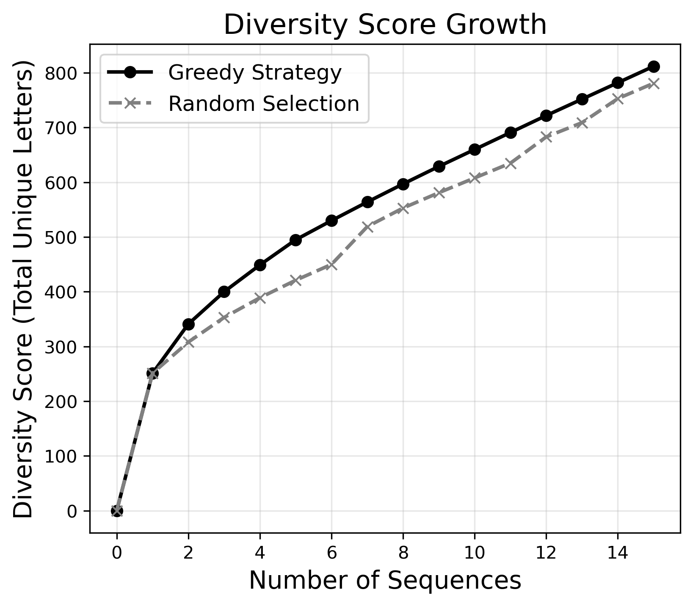
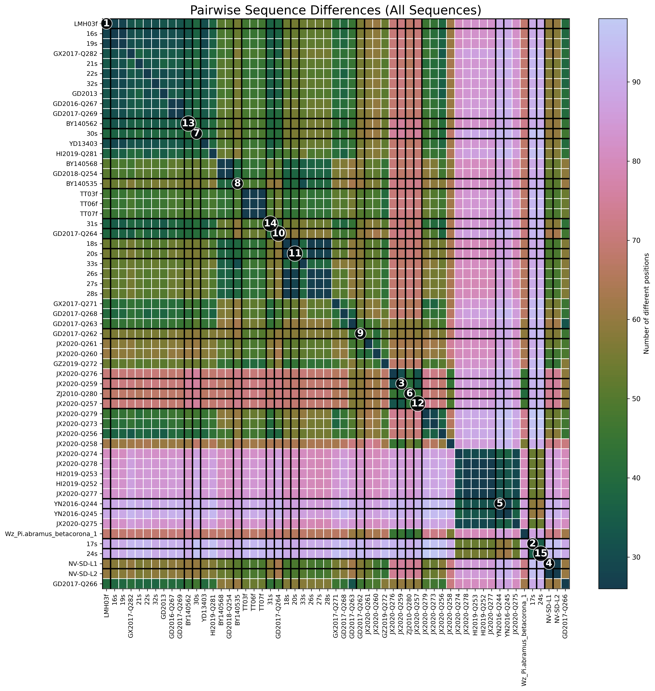

# Greedy spike selection

Small toolkit that employs a greedy algorithm to select amino acid sequences (e.g., CoV spike sequences) to iteratively maximize positional diversity. When no sequence can increase diversity further, ties break by total [Hamming distance](https://en.wikipedia.org/wiki/Hamming_distance) to the selected sequence set.

## Quick start

Install and run via

```bash
>>> pip install git+https://github.com/emkeeler/greedy_spike_selection.git
>>> greedy-select -n number_of_sequences_to_select /path/to/data.csv
```

Input CSVs should follow the following layout:
* the first column holds sequence IDs
* all other columns hold aligned residues (one column per position)

E.g., the first row may be `spike_1,G,V,Y,S,V,S,...`, the second `spike_2,G,V,Y,S,V,S,...`, and so on. Indels are signified by a `-`. See [here](data/hku5_lin1_all.csv) for an example.

### Selecting sequences

The greedy algorithm keeps a running count of which residues have been observed at each position. At every position, the algorithm scans the remaining sequences and selects the one that would introduce the largest number of unseen residues. In cases of a tie, the algorithm select the sequence whose total Hamming distance to the already selected set is greatest.

#### Diversity score

For a chosen subset of sequences, the diversity score is the sum over all positions of the number of unique residues observed.

### Command usage

```bash
usage: greedy-select [-h] [-n N_SELECT] [--start-with START_WITH [START_WITH ...]] [--plot-greedy] [--plot-pairwise] [--figure-dir FIGURE_DIR] csv_path

Select diverse sequences and optionally create visualizations.

positional arguments:
  csv_path              path to the alignment csv file

options:
  -h, --help            show this help message and exit
  -n N_SELECT, --n-select N_SELECT
                        number of sequences to select
  --start-with START_WITH [START_WITH ...]
                        identifiers to pre-select before greedy selection
  --plot-greedy         generate the greedy selection growth plot
  --plot-pairwise       generate the pairwise difference heatmap
  --figure-dir FIGURE_DIR
                        directory where figures will be written
```

The CLI prints the chosen sequence identifiers. If `--plot-greedy` or `--plot-pairwise` is given, PNGs will be saved to `figs/` (or the directory set with `--figure-dir`).

### Example output

```bash
>>> greedy-select --start-with LMH03f NV-SD-L1 20s 17s -n 15 data/hku5_lin1_all.csv
Selected 15 sequences with diversity score 813 (max possible is 3765):
* LMH03f
* NV-SD-L1
* 20s
* 17s
  JX2020-Q276
  YN2016-Q244
  ZJ2010-Q280
  30s
  GD2017-Q262
  BY140535
  GD2017-Q264
  BY140562
  31s
  JX2020-Q257
  24s

* = pre-selected sequence
```

#### Greedy diversity growth

This plot compares cumulative diversity across the greedy subset and a random subset of identical size. Diversity is the unique residue count observed at each position.
<p align="center">

</p>

#### All sequence differences

The heatmap shows pairwise Hamming distances for all sequences in the CSV, with bold borders and labels marking the selected subset.

<p align="center">

</p>


# Contact

* Sam Young youngsam@stanford.edu
* Emma Keeler em.keeler@yale.edu
